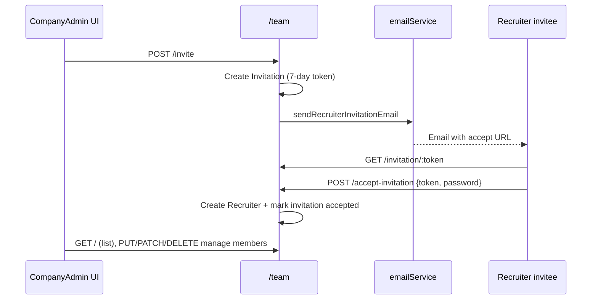
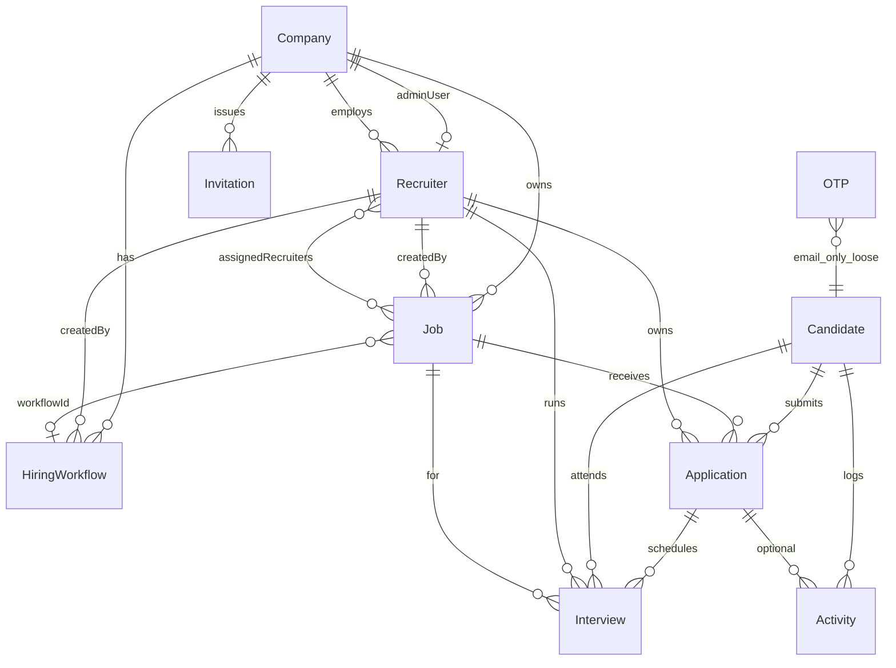

# AI Interview Platform — Project Architecture

> Generated from a full read-only inspection of the repository.  
> Scope: `frontend/`, `backend/`, and notes on `frontend_backup/`.  
> Do not treat `frontend_backup/` as the active app unless explicitly restoring features from it.

---

## 1. Project overview

**AI Interview Platform** (also branded in UI as AI Hiring Platform / CareerHub / RecruitPro / CompanyHQ) is a full-stack hiring product with three personas:

| Persona | Role string | Purpose |
|---------|-------------|---------|
| Candidate | `Candidate` | Register, build profile, apply, take assessments/interviews |
| Company Admin | `CompanyAdmin` | Register company, manage team, oversee hiring |
| Recruiter | `Recruiter` | Join via invitation, manage jobs/candidates/interviews |

**Stack**

| Layer | Technology |
|-------|------------|
| Frontend | React 19, Vite 8, React Router 7, Tailwind CSS 4, shadcn/ui (Base UI), Axios, Framer Motion, Sonner / react-hot-toast |
| Backend | Node.js CommonJS, Express 5, JWT, bcryptjs, Multer, pdf-parse, Nodemailer |
| Database | MongoDB via Mongoose (`AIHiringPlatform` on `127.0.0.1:27017`) |
| AI | Groq SDK (`llama-3.3-70b-versatile`) through `backend/groq.js` |

**Runtime defaults**

- Backend: `http://localhost:5000`
- Frontend API base: hardcoded `http://localhost:5000` in `frontend/src/config/api.js`

**Maturity snapshot:** Auth, company registration, team invitations/email, and candidate CRUD APIs are the strongest areas. Interview generation exists as backend endpoints (UI mainly in backup). Job/application/interview **models** exist; end-to-end product flows are incomplete. Dashboards mix real auth with substantial mock UI.

---

## 2. Complete folder structure

```
AI-Interview-Platform/
├── AGENTS.md
├── PROJECT_ARCHITECTURE.md          # this document
├── .gitignore
├── .cursor/
│   ├── rules/
│   │   ├── ai-interview-platform-developer.mdc
│   │   ├── backend-conventions.mdc
│   │   ├── frontend-conventions.mdc
│   │   ├── project-architecture.mdc
│   │   └── code-quality.mdc
│   └── skills/
│       └── ai-interview-platform-developer/
│           ├── SKILL.md
│           └── codebase-map.md
├── backend/
│   ├── server.js                    # Express entry, mounts, /ask, /evaluate
│   ├── groq.js                      # askGroq(prompt)
│   ├── package.json
│   ├── config/
│   │   ├── db.js                    # MongoDB connect (hardcoded URI)
│   │   └── mail.js                  # Nodemailer transporter
│   ├── controllers/
│   │   ├── dashboardController.js   # GET candidate dashboard aggregate
│   │   └── jobController.js         # Unused / broken (refs missing CompanyAdmin model)
│   ├── models/
│   │   ├── Candidate.js
│   │   ├── Recruiter.js
│   │   ├── Company.js
│   │   ├── Invitation.js
│   │   ├── Job.js
│   │   ├── HiringWorkflow.js
│   │   ├── Application.js
│   │   ├── Interview.js
│   │   ├── Activity.js
│   │   └── OTP.js
│   ├── routes/
│   │   ├── candidateRoutes.js
│   │   ├── recruiterRoutes.js
│   │   ├── companyRoutes.js
│   │   ├── teamRoutes.js
│   │   ├── jobRoutes.js
│   │   ├── workflowRoutes.js
│   │   └── dashboardRoutes.js
│   ├── utils/
│   │   ├── emailService.js          # sendRecruiterInvitationEmail
│   │   └── generateOTP.js           # unused by routes today
│   └── uploads/                     # Multer resume PDFs (runtime)
├── frontend/                        # ACTIVE React app
│   ├── package.json
│   ├── vite.config.js
│   ├── index.html
│   ├── components.json
│   ├── public/
│   └── src/
│       ├── main.jsx
│       ├── App.jsx
│       ├── App.css
│       ├── index.css
│       ├── Home.jsx
│       ├── CandidateLogin.jsx / CandidateSignup.jsx / CandidateDashboard.jsx
│       ├── RecruiterLogin.jsx / RecruiterSignup.jsx / RecruiterDashboard.jsx
│       ├── RecruiterAcceptInvitation.jsx
│       ├── CompanyLogin.jsx / CompanyDashboard.jsx
│       ├── config/
│       │   ├── api.js
│       │   └── navigation.js
│       ├── services/
│       │   ├── candidateService.js
│       │   ├── companyService.js
│       │   ├── recruiterService.js
│       │   └── teamService.js
│       ├── lib/utils.js
│       └── components/
│           ├── auth/ProtectedRoute.jsx
│           ├── candidate/
│           ├── company/TeamManagement.jsx
│           ├── recruiter/
│           ├── dashboard/           # candidate home widgets (mostly static)
│           ├── home/                # landing sections
│           ├── layout/
│           └── ui/                  # shadcn primitives
└── frontend_backup/                 # LEGACY / reference UI (not routed by active App)
    └── src/
        ├── InterviewPage.jsx
        ├── CandidateResumeUpload.jsx
        ├── CandidatePersonalDetails.jsx
        ├── CandidateAcademicDetails.jsx
        ├── CandidateProjects.jsx
        ├── CandidateCertifications.jsx
        ├── RecruiterCreateJob.jsx
        ├── RecruiterCreateWorkflow.jsx
        └── components/recruiter/workflow/*
```

---

## 3. Frontend architecture

### Intended layering (project rules)

```
Pages → Components → Services → api.js (Axios)
```

### Routing (`frontend/src/App.jsx`)

| Path | Component | Guard |
|------|-----------|--------|
| `/` | `Home` | Public |
| `/company/login` | `CompanyLogin` | Public |
| `/company/dashboard` | `CompanyDashboard` | `CompanyAdmin` |
| `/candidate/login` | `CandidateLogin` | Public |
| `/candidate/signup` | `CandidateSignup` | Public |
| `/candidate/dashboard` | `CandidateDashboard` | `Candidate` |
| `/team/accept-invitation` | `RecruiterAcceptInvitation` | Public (token in query) |
| `/recruiter/login` | `RecruiterLogin` | Public |
| `/recruiter/signup` | `RecruiterSignup` | Public — **actually company registration UI** |
| `/recruiter/dashboard` | `RecruiterDashboard` | `Recruiter` |

### Services (active API surface from UI)

| Service | Functions |
|---------|-----------|
| `candidateService` | `loginCandidate`, `registerCandidate` (+ aliases) |
| `companyService` | `registerCompany`, `loginCompany`, `getCompanyProfile` |
| `recruiterService` | `loginRecruiter` |
| `teamService` | `getRecruiters`, `getPendingInvitations`, `inviteRecruiter`, `updateRecruiter`, `updateRecruiterStatus`, `deleteRecruiter`, `deleteInvitation` |

`RecruiterAcceptInvitation` calls Axios directly: `GET /team/invitation/:token`, `POST /team/accept-invitation`.

### UI composition

- **Landing:** `Home` + `components/home/*`
- **Candidate shell:** Navbar + Sidebar + BottomNav; pages `home` / `jobs` / `search` (nav config lists more pages that are not wired)
- **Company shell:** Same layout pattern; `team` page → `TeamManagement`; home/jobs/reports/settings mostly placeholders
- **Recruiter shell:** Standalone dashboard with hardcoded stats (not using layout/nav config fully)

### Auth client

- Axios instance: `config/api.js` → baseURL `http://localhost:5000`
- Request interceptor reads `localStorage.auth` and sets `Authorization: Bearer <token>`
- `ProtectedRoute` enforces `allowedRoles` against `auth.role`

---

## 4. Backend architecture

### Current reality vs target layering

**Target (project rules):** `Routes → Controllers → Services → Models`

**Current:** Most logic lives **inside route files**. Controllers exist only for dashboard (used) and jobs (orphaned). There is **no `backend/services/`** layer yet. Email helpers live in `utils/`.

### Entry (`server.js`)

1. `dotenv` + `connectDB()`
2. CORS + JSON
3. Static `/uploads`
4. Mount routers (below)
5. Inline AI routes: `POST /ask`, `POST /evaluate`
6. Listen on port **5000**

### Mount table

| Mount | Router |
|-------|--------|
| `/candidate` | `candidateRoutes` |
| `/recruiter` | `recruiterRoutes` |
| `/company` | `companyRoutes` |
| `/team` | `teamRoutes` |
| `/job` | `jobRoutes` |
| `/workflow` | `workflowRoutes` |
| `/dashboard` | `dashboardRoutes` |

### Shared patterns

- JSON responses typically `{ success, message?, ... }` (team routes often wrap payload in `data`)
- Auth: bcrypt hash (cost 10), JWT (`JWT_SECRET`, 7d expiry)
- Company/team admin auth helpers duplicated in `companyRoutes` and `teamRoutes` (`getTokenFromRequest`)

---

## 5. Authentication flow

### Roles and storage

Unified client shape (company, recruiter, and candidate logins):

```json
{
  "token": "<jwt>",
  "role": "Candidate | Recruiter | CompanyAdmin",
  "user": { /* persona object */ }
}
```

Stored in `localStorage` key **`auth`**.

### Candidate

1. `POST /candidate/register` — email, phone, password → bcrypt → `Candidate`
2. `POST /candidate/login` — JWT payload `{ id }` only (no role claim)
3. Frontend sets `role: "Candidate"` client-side and stores full `candidate` as `user`

### Company Admin

1. `POST /company/register` — creates `Company` + `Recruiter` with `role: CompanyAdmin`, links `company.adminUser`
2. `POST /company/login` — finds `Recruiter` where `role === CompanyAdmin`
3. JWT payload: `{ id, role, companyId }`

### Recruiter

1. Created only via invitation accept (not open self-signup for recruiter role)
2. `POST /recruiter/login` — rejects `CompanyAdmin` (must use company login); requires `invitationAccepted` and active status
3. JWT payload: `{ id, role, companyId }`

### Guards

| Layer | Behavior |
|-------|----------|
| Frontend `ProtectedRoute` | Redirect unauthenticated → role login; wrong role → that role’s dashboard |
| Backend team/company profile | Bearer JWT verified; admin must be `CompanyAdmin` |
| Most candidate/job/workflow routes | **No JWT middleware** — identify by body/params (`email`, `recruiterId`) |

### Known auth inconsistency

`CandidateDashboard` / `HeroSection` still read `localStorage.getItem("candidate")`, while login writes **`auth`**. Candidate dashboard user display can break unless something else writes `candidate`.

---

## 6. Candidate workflow

### Implemented (API)

1. Register / login  
2. Profile enrichment by email:
   - `POST /candidate/personal-details`
   - `POST /candidate/academic-details`
   - `POST /candidate/projects`
   - `POST /candidate/certifications`
3. `GET /candidate/profile/:email`
4. `GET /candidate/all` (unauthenticated list — sensitive)
5. Resume upload + parse (see §§10–11)
6. `GET /dashboard/:candidateId` — aggregates applications, upcoming interview, activities, stats

### Implemented (UI — active frontend)

- Signup / login forms  
- Dashboard shell with static/mock widgets (`UpcomingInterviewCard`, pipeline cards, etc.)  
- Sidebar nav items for profile/applications/assessments/… mostly **not implemented** as pages

### Present only in `frontend_backup`

- Personal / academic / projects / certifications pages  
- Resume upload page  
- Older interview playground

### Not connected end-to-end

- Job apply → `Application` creation from candidate UI  
- Real dashboard API wiring  
- Assessments / interviews / reports / notifications screens

---

## 7. Company workflow

### Implemented

1. **Registration** via `/recruiter/signup` page → `registerCompany` → `POST /company/register`  
2. **Login** → `POST /company/login` → dashboard  
3. **Profile** API: `GET /company/profile` (Bearer)  
4. **Team management** UI (see §9)  
5. Company record fields: name, website, industry, size, location, status, `adminUser`

### Partial / missing UI

- Company dashboard home is a placeholder  
- Jobs / Reports / Settings nav entries not built  
- No dedicated company registration route name (uses recruiter signup path)  
- `GET /company/:companyId` exists but no first-class UI consumer found

---

## 8. Recruiter workflow

### Implemented

1. Accept invitation → set password → `Recruiter` created (`status: active`)  
2. Login → dashboard  
3. Backend job helpers:
   - `POST /recruiter/jobs` (legacy field names: `roleName`, `minPackage`, … — **misaligned with `Job` schema**)
   - `GET /recruiter/jobs/:recruiterId`
   - `POST /job/create` (spreads body into `Job` with recruiter company binding)
   - `GET /job/all/:recruiterId`
4. Workflow API: `POST /workflow/create`, `GET /workflow/all`

### UI status

- Dashboard shows **hardcoded** metrics and sample job rows  
- “Create Job” button has **no handler**  
- Workflow builder / create job screens live in **`frontend_backup` only**  
- `RecruiterSignupForm` / `RecruiterOtpForm` appear unused by current company-register signup page

---

## 9. Team Management workflow

**Primary UI:** `frontend/src/components/company/TeamManagement.jsx`  
**API:** `/team/*` (CompanyAdmin JWT required except invitation public endpoints)



### Admin operations

| Action | Endpoint |
|--------|----------|
| List recruiters (+ assigned job counts) | `GET /team/` |
| Invite | `POST /team/invite` |
| List invitations | `GET /team/invitations` |
| Delete pending invitation | `DELETE /team/invitation/:id` |
| Update designation/department/permissions | `PUT /team/:id` |
| Enable/disable | `PATCH /team/:id/status` |
| Soft-delete recruiter | `DELETE /team/:id` |

### Public invitation

| Action | Endpoint |
|--------|----------|
| Preview invite | `GET /team/invitation/:token` |
| Accept + set password | `POST /team/accept-invitation` |

Accept URL: `{FRONTEND_URL}/team/accept-invitation?token=...`

### Debug (should not ship)

- `GET /team/debug-admin`
- `GET /team/debug-invitations`

---

## 10. Resume upload workflow

### Backend (implemented)

1. Multer disk storage → `uploads/` with timestamp filename  
2. PDF-only `fileFilter`  
3. `POST /candidate/upload-resume` — multipart field `resume` + body `email`  
4. Saves `candidate.resumeUrl` as **filename only**  
5. Files served at `GET /uploads/<filename>`

### Frontend (active)

- **No** resume upload UI in current `frontend/`  
- Exists in `frontend_backup/src/CandidateResumeUpload.jsx`

### Gaps

- No auth on upload (email spoofable)  
- No max file size limit configured  
- Relative `uploads/` path depends on process cwd  
- No virus scanning / content validation beyond MIME

---

## 11. Resume parsing workflow (current status)

### Backend (implemented)

`POST /candidate/parse-resume` with `{ email }`:

1. Load candidate + require `resumeUrl`  
2. Read PDF from `backend/uploads/<resumeUrl>` via `pdf-parse`  
3. Prompt Groq to extract skills JSON:

```json
{
  "programmingLanguages": [],
  "frameworks": [],
  "databases": [],
  "tools": [],
  "concepts": []
}
```

4. Flatten arrays → `candidate.skills`  
5. Return `{ success, skills }`

### Fragility

- Assumes Groq returns **pure JSON** (`JSON.parse` on raw model text) — fails if markdown fences/explanations appear  
- Does not persist structured categories — only flat `skills[]`  
- No UI in active frontend  
- No JWT protection

### Status label: **Backend prototype complete; not productized / not wired to active UI**

---

## 12. Interview generation workflow

### Backend (implemented on app root)

**Generate question** — `POST /ask`

```json
{ "category": "Java", "difficulty": "Easy" }
```

→ Groq prompt as senior interviewer → `{ answer: "<question text>" }`

**Evaluate answer** — `POST /evaluate`

```json
{ "question": "...", "answer": "..." }
```

→ Scores + feedback + follow-up (free text) → `{ evaluation: "<text>" }`

### Data model

`Interview` schema supports scheduled rounds (`HR`, `Technical`, `Managerial`, `Coding`, `AI Interview`) tied to `Application` / `Job` / users — **no CRUD routes** create these records yet.

### Frontend

- Active app: **no** interview session page  
- Backup: `frontend_backup/src/InterviewPage.jsx` calls `/ask` and `/evaluate` with raw `fetch`

### Status: **Stateless AI demo endpoints exist; hiring-pipeline interview orchestration does not**

---

## 13. Coding interview workflow

### Finding

There is **no dedicated coding assessment engine** in the active codebase:

- No code execution sandbox  
- No problem bank / submissions model  
- No Monaco/CodeMirror editor in `frontend/`  
- `Interview.interviewRound` enum includes `"Coding"` as a label only  
- Application status enum includes `"Assessment"` as a pipeline state only  
- Candidate nav lists “Assessments” but no page implementation

### Closest related pieces

- Groq technical Q&A (`/ask`, `/evaluate`) — verbal/technical, not code-run  
- `HiringWorkflow` rounds can store `topics` / `difficultyPattern` / `passingScore` — unused by coding UI

### Status: **Not implemented (schema placeholders only)**

---

## 14. Email invitation workflow

### Stack

- `backend/config/mail.js` — Nodemailer SMTP (`EMAIL_HOST`, `EMAIL_PORT`, `EMAIL_USER`, `EMAIL_PASS`)  
- Sets `NODE_TLS_REJECT_UNAUTHORIZED = "0"` and `tls.rejectUnauthorized: false`  
- `backend/utils/emailService.js` → `sendRecruiterInvitationEmail`

### Flow

1. Admin invites recruiter  
2. Token = `crypto.randomBytes(32).toHex`  
3. Expiry = now + 7 days  
4. HTML email with Accept button → `FRONTEND_URL/.../accept-invitation?token=`  
5. On accept failure paths, email errors propagate (invite create may fail if SMTP fails — no deferred queue)

### Other email

- OTP model + `generateOTP` exist but **are not used** by current routes  
- Recruiter OTP UI components are not wired to backend OTP

---

## 15. Database schema relationships



### Entity notes

| Model | Key relationships / quirks |
|-------|----------------------------|
| `Company` | `adminUser` → `Recruiter` |
| `Recruiter` | Dual role enum `CompanyAdmin` \| `Recruiter`; soft delete flags |
| `Invitation` | `createdBy` ref string `"CompanyAdmin"` (not a real model name) |
| `Job` | `createdBy` ref `"CompanyAdmin"` but routes set Recruiter `_id`; `workflowId` ref `"Workflow"` vs model name `HiringWorkflow` |
| `Application` / `Interview` / `Activity` | Designed for pipeline; little/no write API usage from UI |
| `OTP` | Standalone by email; unused |
| `Candidate` | Profile + `resumeUrl` + `skills[]` |

**MongoDB name:** `AIHiringPlatform` (hardcoded in `config/db.js`).

---

## 16. API endpoints grouped by module

Base: `http://localhost:5000`

### System

| Method | Path | Auth | Notes |
|--------|------|------|-------|
| GET | `/` | No | Health message |
| POST | `/ask` | No | AI question |
| POST | `/evaluate` | No | AI evaluation |

### Candidate (`/candidate`)

| Method | Path | Auth | Notes |
|--------|------|------|-------|
| POST | `/register` | No | |
| POST | `/login` | No | JWT `{ id }` |
| POST | `/personal-details` | No* | keyed by email |
| POST | `/academic-details` | No* | |
| POST | `/projects` | No* | |
| POST | `/certifications` | No* | |
| GET | `/all` | No | lists all candidates |
| POST | `/upload-resume` | No* | multipart |
| GET | `/profile/:email` | No | |
| POST | `/parse-resume` | No* | Groq + pdf-parse |

\*Should require JWT in production.

### Company (`/company`)

| Method | Path | Auth |
|--------|------|------|
| POST | `/register` | No |
| POST | `/login` | No |
| GET | `/profile` | Bearer CompanyAdmin |
| GET | `/:companyId` | No |

### Recruiter (`/recruiter`)

| Method | Path | Auth |
|--------|------|------|
| POST | `/login` | No |
| GET | `/all` | No |
| POST | `/jobs` | No* (body recruiterId) |
| GET | `/jobs/:recruiterId` | No |

### Team (`/team`)

| Method | Path | Auth |
|--------|------|------|
| GET | `/` | CompanyAdmin |
| POST | `/invite` | CompanyAdmin |
| GET | `/invitations` | CompanyAdmin |
| DELETE | `/invitation/:id` | CompanyAdmin |
| GET | `/invitation/:token` | Public |
| POST | `/accept-invitation` | Public |
| PUT | `/:id` | CompanyAdmin |
| PATCH | `/:id/status` | CompanyAdmin |
| DELETE | `/:id` | CompanyAdmin |
| GET | `/debug-admin` | **None — remove** |
| GET | `/debug-invitations` | **None — remove** |

### Jobs (`/job`)

| Method | Path | Auth |
|--------|------|------|
| POST | `/create` | No* (recruiterId) |
| GET | `/all/:recruiterId` | No |

### Workflow (`/workflow`)

| Method | Path | Auth |
|--------|------|------|
| POST | `/create` | No* |
| GET | `/all` | No |

### Dashboard (`/dashboard`)

| Method | Path | Auth |
|--------|------|------|
| GET | `/:candidateId` | No |

---

## 17. Environment variables

| Variable | Used in | Purpose |
|----------|---------|---------|
| `JWT_SECRET` | company, recruiter, candidate, team routes | Sign/verify JWTs |
| `GROQ_API_KEY` | `groq.js` | Groq API |
| `EMAIL_HOST` | `config/mail.js` | SMTP host |
| `EMAIL_PORT` | `config/mail.js` | SMTP port |
| `EMAIL_USER` | `mail.js`, `emailService.js` | SMTP user / From |
| `EMAIL_PASS` | `mail.js` | SMTP password |
| `FRONTEND_URL` | `teamRoutes.js` | Invitation link base (fallback to API host) |
| `NODE_TLS_REJECT_UNAUTHORIZED` | set to `"0"` in `mail.js` | Disables TLS verification (insecure) |

**Not env-driven today**

- MongoDB URI (hardcoded `mongodb://127.0.0.1:27017/AIHiringPlatform`)  
- Backend port `5000`  
- Frontend Axios `baseURL`  
- Groq model name (`llama-3.3-70b-versatile` hardcoded)

Frontend: no `import.meta.env` usage found for API config.

---

## 18. Third-party integrations

| Integration | Package | Usage |
|-------------|---------|--------|
| **Groq** | `groq-sdk` | Interview Q&A + resume skill extraction |
| **MongoDB** | `mongoose` (used; **missing from `package.json` dependencies**) | Persistence |
| **SMTP email** | `nodemailer` | Recruiter invitations |
| **PDF parse** | `pdf-parse` | Resume text extraction |
| **Uploads** | `multer` | Resume files |
| **Auth crypto** | `bcryptjs`, `jsonwebtoken` | Passwords / JWT |
| **Google Generative AI** | `@google/generative-ai` | **Declared unused** — no imports in source |
| **UI** | React ecosystem, Tailwind, shadcn/Base UI, Lucide, Framer Motion, Axios, Sonner | Frontend |

---

## 19. Current implemented features

**Working / substantially present**

- Candidate register & login (API + UI)  
- Company register & login (API + UI; signup under recruiter path)  
- Recruiter login (API + UI) after invitation  
- Company admin team invite, email, accept-invitation, CRUD-ish team ops (API + UI)  
- Candidate profile update endpoints  
- Resume upload + Groq skill parse (API only)  
- Stateless AI interview question + evaluation endpoints  
- Hiring workflow create/list API  
- Job create/list APIs (partial schema alignment)  
- Candidate dashboard aggregate API  
- Landing page + role portals entry  
- Protected routes by role  
- Cursor project agent rules/skills  

**UI partially present**

- Candidate dashboard layout with mock cards  
- Company dashboard shell + Team Management  
- Recruiter dashboard mock stats  

---

## 20. Missing features

- End-to-end job posting UI (active frontend)  
- Candidate job browse/apply → `Application` lifecycle  
- Interview scheduling CRUD + calendar UI  
- Live AI interview session in active `frontend/`  
- Coding assessments / code execution  
- Resume upload & profile builder in active frontend (exist in backup)  
- Workflow builder in active frontend (exists in backup)  
- Real-time notifications  
- Reports / analytics backed by data  
- Email/phone verification (flags exist; OTP unused)  
- Permission enforcement beyond CompanyAdmin vs Recruiter role  
- Shared auth middleware on all protected APIs  
- Password reset / account recovery  
- Admin audit logs  
- Tests (backend `test` script is a stub)  
- Production config (env-based DB/URL/CORS)  
- CI/CD  

---

## 21. Known technical debt

1. **Layering:** Fat routes; missing services; orphan `jobController` requiring nonexistent `CompanyAdmin` model; trailing junk character in controller file.  
2. **Schema ref mismatches:** `Job.createdBy` / `Invitation.createdBy` ref `"CompanyAdmin"`; `Job.workflowId` ref `"Workflow"` vs `HiringWorkflow`.  
3. **Dual job APIs:** `/recruiter/jobs` field names don’t match `Job` schema; `/job/create` is closer but still loose.  
4. **Auth gaps:** Many mutating endpoints trust `email` / `recruiterId` without JWT; candidate JWT omits `role`.  
5. **localStorage split:** Login writes `auth`; candidate dashboard still reads `candidate`.  
6. **Nav vs pages:** Sidebar lists pages that don’t render.  
7. **`mongoose` not listed** in `backend/package.json` dependencies (relies on transitive/hoisted install luck).  
8. **Unused deps/code:** `@google/generative-ai`, OTP model/util, debug team routes, unused recruiter OTP forms.  
9. **Security:** TLS verification disabled for mail; open candidate listing; no rate limits on AI/auth; hardcoded secrets risk if `.env` mishandled.  
10. **AI parsing:** Brittle `JSON.parse` on LLM output.  
11. **`frontend_backup`:** Diverged feature set creates confusion and duplication risk.  
12. **Hardcoded** Mongo URI, ports, API base URL, Groq model.  
13. **RecruiterSignup naming:** Page registers companies, not recruiters.  
14. **No automated tests** or lint gate on backend.

---

## 22. Suggested roadmap to production

### Phase 0 — Stabilize foundation (1–2 weeks)

- Add `mongoose` (and pin versions) to backend dependencies  
- Env-driven `MONGODB_URI`, `PORT`, `CLIENT_URL`, Axios `VITE_API_URL`  
- Remove debug routes; restore TLS verification for SMTP with proper certs  
- Unify localStorage on `auth`; fix candidate dashboard reads  
- Introduce shared `authMiddleware` + role checks; lock down email-keyed candidate routes  
- Delete or quarantine broken `jobController` / fix refs  
- Document required `.env.example`

### Phase 1 — Complete hiring core (2–4 weeks)

- Single Job API aligned to `Job` schema; company + recruiter create/list UI  
- Candidate job board + apply → `Application` status machine  
- Wire `GET /dashboard/:id` into candidate home (replace mocks)  
- Restore profile + resume upload/parse UI from backup into active frontend  
- Soft-delete invitation UX polish; permission flags honored in API

### Phase 2 — Interviews & AI productization (3–5 weeks)

- Interview scheduling CRUD using `Interview` model  
- Active AI interview UI (multi-turn) on top of Groq; store Q/A/scores  
- Harden resume parse (JSON repair, retries, structured skills)  
- Workflow builder restored and linked to jobs via correct `HiringWorkflow` ref  
- Evaluation rubrics per round; recruiter review UI

### Phase 3 — Coding assessments (optional track)

- Problem bank + submission model  
- Sandboxed runner (or third-party judge)  
- Round type `Coding` wired into workflow  
- Plagiarism / timeout / language constraints

### Phase 4 — Production hardening

- Rate limiting, Helmet, CORS allowlist, request validation (Zod/Joi)  
- Structured logging + error monitoring  
- Email queue (retries) for invitations  
- Backup/restore, indexes review, file storage (S3) instead of local disk  
- E2E tests (auth, invite, apply, interview) + CI  
- Remove `frontend_backup` from deploy artifacts or archive cleanly  
- Accessibility, performance, and security review

### Success criteria for “production-ready MVP”

- Three roles can complete: company onboard → invite recruiter → post job → candidate apply → AI interview round → status update  
- No unauthenticated PII list endpoints  
- Config via environment only  
- Critical paths covered by automated tests  

---

## Appendix A — Active vs backup feature matrix

| Feature | Backend | Active frontend | Backup frontend |
|---------|---------|-----------------|-----------------|
| Candidate auth | Yes | Yes | Yes |
| Profile builder pages | Yes | No | Yes |
| Resume upload/parse | Yes | No | Upload UI yes |
| Company auth + team | Yes | Yes | Partial |
| Recruiter auth | Yes | Yes | Yes |
| Job create UI | Partial API | No | Yes |
| Workflow builder | API | No | Yes |
| AI `/ask` `/evaluate` | Yes | No | InterviewPage |
| Coding assessment | No | No | No |
| Applications pipeline | Model + dashboard read | Mock UI | Limited |

---

## Appendix B — Quick start (local)

1. MongoDB running locally  
2. Backend `.env` with JWT, Groq, email vars  
3. `cd backend && npm install && node server.js`  
4. `cd frontend && npm install && npm run dev`  
5. Register company → Team invite → accept link → recruiter login  

---

*End of architecture document.*
